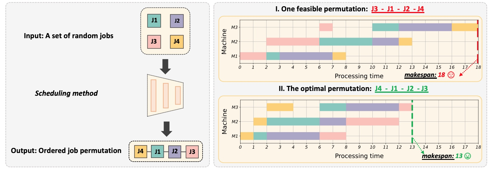
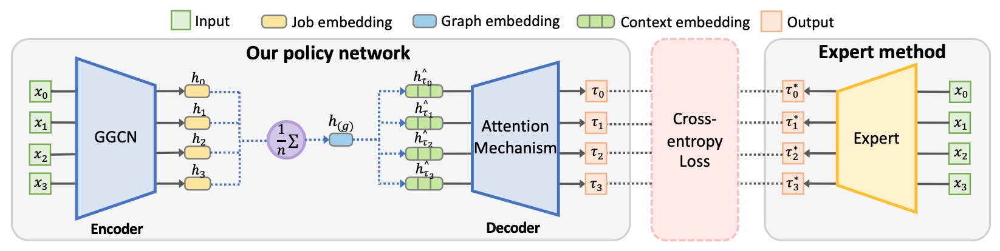

# [AAAI 2024] Learning to Optimize Permutation Flow Shop Scheduling via Graph-based Imitation Learning

This is the official implementation for the paper **"Learning to Optimize Permutation Flow Shop Scheduling via Graph-based Imitation Learning"**, AAAI 2024.


If you find it useful, please consider citing:
```
@inproceedings{li2024learning,
  title={Learning to Optimize Permutation Flow Shop Scheduling via Graph-based Imitation Learning},
  author={Li, Longkang and Liang, Siyuan and Zhu, Zihao and Ding, Chris and Zha, Hongyuan and Wu, Baoyuan},
  booktitle={Proceedings of the AAAI Conference on Artificial Intelligence},
  year={2024}
}
```


## Overview

- The permutation flow shop scheduling (PFSS), aiming at finding the optimal permutation of jobs, is widely used in manufacturing systems. 


- In our paper, we train the model via expert-driven **imitation learning** to accelerate the convergence. Our learning model is based on the **graph structure**, which incorporates the GGCN (Gated Graph ConvNets) as the encoder.




## Implementations

For our imitation learning model, our code is developing based on [here](https://github.com/chaitjo/learning-tsp).  

- Installation:

```sh
# Environment: Ubuntu 16.04, using Python 3.6.7, PyTorch 1.2.0 and CUDA 10.0. Anaconda
# Clone the repository. 
git clone https://github.com/SCLBD/IL_PFSS.git 

# Set up a new conda environment and activate it.
conda create -n tsp python=3.6.7
source activate tsp

# Install all dependencies and Jupyter Lab (for using notebooks).
conda install pytorch=1.2.0 cudatoolkit=10.0 -c pytorch  
conda install numpy scipy cython tqdm scikit-learn matplotlib seaborn tensorboard pandas
conda install jupyterlab -c conda-forge
pip install tensorboard_logger
```


- Quick start for our imitation learning model 
```sh
cd learning-pfss

# Quick Training
./scripts/train.sh 
    
# Quick Testing.   
./scripts/test.sh
```

For the other four heuristic baselines (random search, iterated local search, iterated greedy, NEH), our code is developing based on [here](https://github.com/omega-coder/flowshop_scheduling_problem).

```sh
cd baselines
python run_heuristics.py 
```


## Acknowledgement and Related Work:

We thank those papers for giving us inspirations:

- [Chaitanya K. Joshi, Quentin Cappart, Louis-Martin Rousseau, Thomas Laurent. Learning TSP Requires Rethinking Generalization. International Conference on Principles and Practice of Constraint Programming (CP 2021).](https://arxiv.org/abs/2006.07054)
- [W. Kool, H. van Hoof, and M. Welling. Attention, learn to solve routing problems! In International Conference on Learning Representations, 2019.](https://openreview.net/forum?id=ByxBFsRqYm)
- [M. Deudon, P. Cournut, A. Lacoste, Y. Adulyasak, and L.-M. Rousseau. Learning heuristics for the tsp by policy gradient. In International Conference on the Integration of Constraint Programming, Artificial Intelligence, and Operations Research, pages 170–181. Springer, 2018.](https://link.springer.com/chapter/10.1007/978-3-319-93031-2_12)
- [C. K. Joshi, T. Laurent, and X. Bresson. An efficient graph convolutional network technique for the travelling salesman problem. arXiv preprint arXiv:1906.01227, 2019.](https://arxiv.org/abs/1906.01227)
- [A. Nowak, S. Villar, A. S. Bandeira, and J. Bruna. A note on learning algorithms for quadratic assignment with graph neural networks. arXiv preprint arXiv:1706.07450, 2017.](https://arxiv.org/abs/1706.07450v1)
- [I. Bello, H. Pham, Q. V. Le, M. Norouzi, and S. Bengio. Neural combinatorial optimization with reinforcement learning. In International Conference on Learning Representations, 2017.](https://arxiv.org/abs/1611.09940)


We thank those github source codes for helping to build our own codes:

- [https://github.com/chaitjo/learning-tsp](https://github.com/chaitjo/learning-tsp)
- [https://github.com/omega-coder/flowshop_scheduling_problem](https://github.com/omega-coder/flowshop_scheduling_problem)


